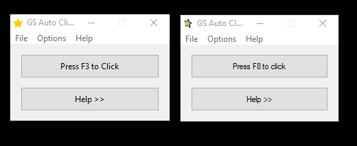
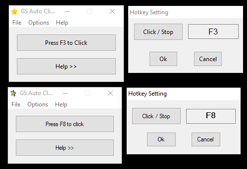
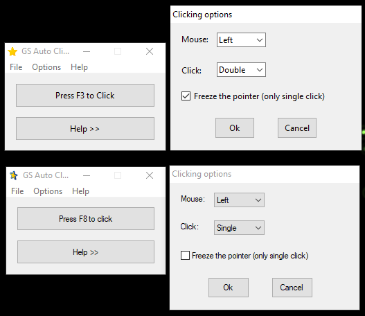
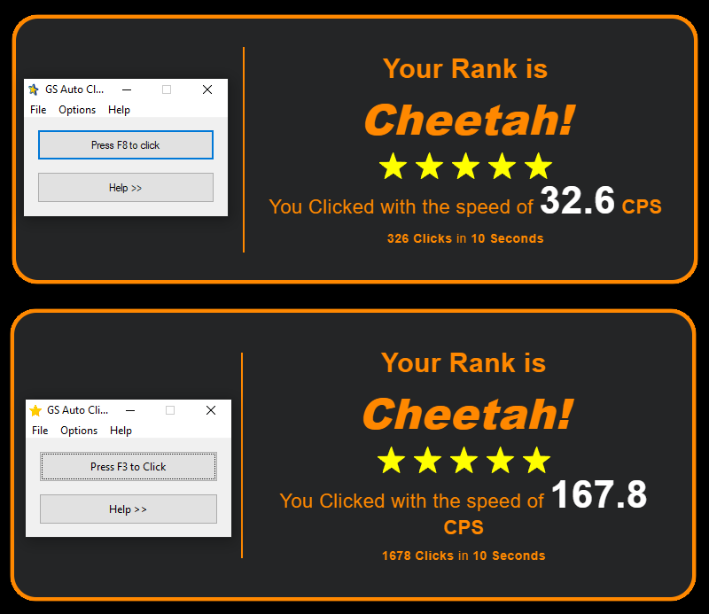

# Auto Clicker "Perfect Copy"

## O que é este projeto?
Este é um projeto de aprendizado que eu desenvolvi para aprender a biblioteca Tkinter e melhorar minha base em Python. Posteriormente, refiz este projeto utilizando Programação Orientada a Objetos (POO) para aprofundar meu conhecimento em POO e interfaces gráficas. Aproveitei também para criar um canal no YouTube como hobby e fiz uma mega timelapse da segunda versão. Você pode conferir a playlist [aqui](https://www.youtube.com/playlist?list=PLpRadUoUz-_FEx5YHd7D4vJI99cOFM26p).

## Por que um clone do GS Auto Clicker?
Escolhi clonar o GS Auto Clicker porque é um aplicativo existente que eu já usei bastante, então achei que conseguiria recriá-lo de forma fácil.

## Estrutura de Pastas
- **for use**: Contém o programa em si, um ícone e um arquivo que salva as configurações.
- **first_version**: Código fonte da primeira versão do aplicativo usando programação estruturada.
- **finish**: Código fonte da segunda versão usando POO.

## Sobre o aplicativo
Para usar, baixe a pasta `for use` e execute o aplicativo. Comparado ao original, ele tem todas as funcionalidades principais, clica mais rápido, mas não possui os links do site oficial e os botões relacionados não fazem nadaz.

## Tecnologias Utilizadas
- Python
- Tkinter
- Bibliotecas para controle do mouse como `mouse`, `keyboard`, `win32con`, entre outras.

## Aprendizado
Este projeto me ajudou a evoluir bastante em Python, principalmente na base e no POO. Na POO, aprendi a base e iniciei o aprendizado (posteriormente pratiquei e aprendi muito mais em Java). Em interfaces gráficas, aprendi bastante sobre os widgets e seu funcionamento geral.

Obs.: Aprendi muito sobre Tkinter com [este vídeo](https://www.youtube.com/watch?v=mop6g-c5HEY&t=3s&ab_channel=ClearCode).

## Expectativas
- Praticar a base de Python que eu tinha.
- Aprender sobre interfaces gráficas.
- Talvez conseguir "clonar" o GS Auto Clicker.

## Realidade
- #aprendizado
- Consegui fazer um clone muito bom do GS Auto Clicker, de forma que, ao usar, fica muito difícil saber qual é qual.

## Comparativo
A minha versão é a com a estrela 100% amarela

